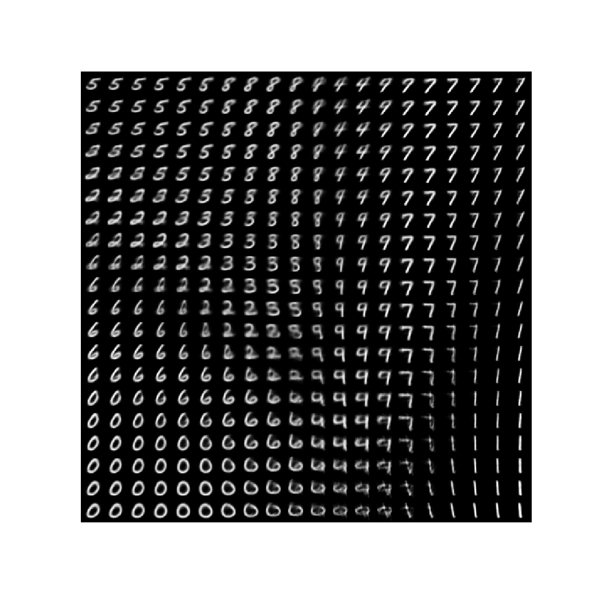

# Variational-AutoEncoders-on-MNIST
Linear Layers based variational auto-encoder on MNIST

## Dataset
MNIST

## You need
- PyTorch
- torchvision
- numpy

# Results
We get the following results with a 2 dimensional latent space :

## Reconstruction and Sampling
Reconstruction and Sampling example :

## Distangling Factors of Variation
Sampling while varying dimensions in latent space :

## Embeddings in latent space
Embeddings in latent space for each class (encoder output on an exmaple of every class) :

